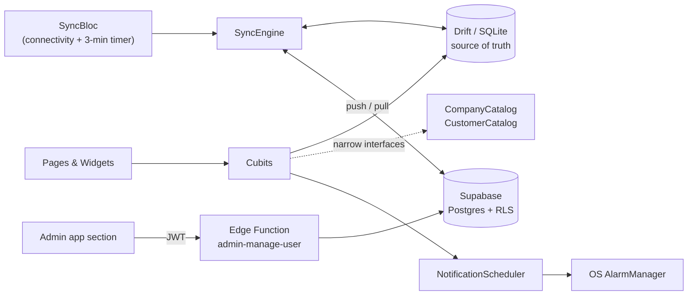

<div align="center">


# eSIM Dafter

**An offline-first sales, inventory and debt-tracking app for independent eSIM / SIM resellers.**

Buy bundles wholesale from supplier companies, resell them to your customers, and always know your profit, your balances and who owes you money — even with no internet connection.


</div>

---

## Table of Contents

1. [Project Overview](#1-project-overview)
2. [Tech Stack](#2-tech-stack)
3. [Architecture](#3-architecture)
4. [Features](#4-features)
5. [Testing](#5-testing)
6. [Folder Structure](#6-folder-structure)
7. [How to Run the Project](#7-how-to-run-the-project)
8. [Future Improvements](#8-future-improvements)
9. [Screenshots](#9-screenshots)
10. [Social Links](#10-social-links)

---

## 1. Project Overview

**eSIM Dafter** (formerly *SIM Sales Manager*) is a mobile-first business app for independent sellers who buy eSIM / SIM packages in bulk from telecom supplier companies at wholesale prices and resell them one by one to customers at retail prices.

It replaces the notebook-and-spreadsheet workflow with a single app that tracks:

- **Profit** — automatically calculated per sale (retail price minus wholesale cost).
- **Supplier balances** — every company has a balance pool that shipments top up and sales consume.
- **Customer debts** — partial and unpaid payments, with per-customer and per-line breakdowns.
- **Expiry dates** — every sold line has an expiry, with reminders before it lapses.

### Why it is interesting from an engineering point of view

- **Offline-first.** A local Drift (SQLite) database is the single source of truth. The UI never waits on the network; a background sync engine reconciles with Supabase whenever a connection is available — including flaky mobile data.
- **Multi-tenant by design.** Many independent sellers share one deployment, each with fully private data enforced server-side by Postgres Row Level Security. An **admin role** manages accounts and a shared "ready-made company" catalog from inside the same app.
- **Bilingual with real RTL support.** Full English and Arabic (Modern Standard Arabic) localization, dark and light themes, and a strict shared design system.
- **Notifications that survive a closed app.** Reminders are scheduled with the OS alarm system, so they fire even when the app process is not running.

> This app is distributed directly (as an APK) rather than through an app store, so it ships with its own **in-app update system** backed by Supabase Storage.

---

## 2. Tech Stack

| Area | Technology |
| --- | --- |
| **Framework / Language** | Flutter, Dart (`sdk: ^3.11.0`) |
| **State management** | `flutter_bloc` — **Cubit** by default, full **Bloc** only for the event-driven sync engine — plus `equatable` |
| **Local database** | [Drift](https://drift.simonbinder.eu/) on SQLite (`sqlite3`), schema migrations up to v12 |
| **Backend** | [Supabase](https://supabase.com/) — Postgres + Row Level Security, Auth, Storage, Realtime, Edge Functions (Deno / TypeScript) |
| **Dependency injection** | `get_it` (composition root in `core/di`) |
| **Connectivity** | `connectivity_plus` with a real reachability probe |
| **Localization** | `easy_localization` — English & Arabic, RTL-aware |
| **Charts** | `fl_chart` |
| **Export** | `excel`, `pdf`, `share_plus` — PDF / Excel / CSV |
| **Notifications** | `flutter_local_notifications` + `timezone` (OS-level scheduled alarms) |
| **Media** | `image_picker`, `record`, `audioplayers` (photo and voice-note attachments) |
| **Web content** | `webview_flutter` (supplier portals used by Number Update) |
| **Platform helpers** | `url_launcher` (WhatsApp / SMS), `device_info_plus`, `package_info_plus`, `open_filex`, `http`, `path_provider` |
| **Tooling** | `build_runner`, `drift_dev`, `flutter_lints`, `flutter_launcher_icons`, `flutter_native_splash` |
| **Typography** | IBM Plex Sans Arabic (400 / 500 / 600 / 700) |

---

## 3. Architecture

The project follows a **feature-first Clean Architecture**: a shared `core/` layer and self-contained `features/`, each split into `data`, `domain` and `presentation`.



### Key design decisions

**Offline-first data flow**

1. Every write goes to the local Drift database **immediately**, tagged `synced = false` with an `updated_at` timestamp.
2. The UI updates optimistically — it never blocks on the network.
3. `SyncBloc` triggers `SyncEngine.syncAll` on app start, on connectivity changes, on demand ("Sync now"), and every 3 minutes as a safety net. Push always runs before pull.
4. Conflict resolution is **last-write-wins** on `updated_at` — a deliberate simplification, not an oversight.

**Reliability details worth calling out**

- **Fault-isolated sync steps.** Each table's push/pull runs in its own `try/catch`, so one failing table can never silently starve the rest of the chain.
- **Delete tombstones.** Permanent deletes are recorded in a `pending_deletes` table until the server confirms them, so a pull can never resurrect a row that was deliberately removed.
- **Pending-changes indicator.** The app counts every unsynced row and tombstone and shows it in the top bar and in Settings, so a seller knows whether it is safe to uninstall or switch devices.
- **Optimistic company balances.** Balance mutations (`applySale` / `reverseSale` / `applyShipment` / `applyAdditionalServiceCharge`) update the UI instantly, while every reload recomputes balances from persisted rows so estimates can never drift permanently.

**Multi-tenancy and roles**

- Every tenant table carries an `owner_id`, protected by an RLS policy of `owner_id = auth.uid()`.
- A shared `company_catalog` / `package_catalog` is readable by everyone and writable only by admins. "Import Ready-Made Company" **copies** from it once — it is never a live link, so each seller's data stays independent.
- Privileged account operations (create seller, activate / deactivate, change role) go through a Supabase **Edge Function** that verifies the caller's JWT is an admin. The client never holds a service-role key.

**Decoupling between features**

Features do not import each other. Cross-feature access goes through narrow interfaces in `core/catalog` (`CompanyCatalog`, `CustomerCatalog`), and `core/di/service_locator.dart` is the single composition root that knows the concrete Cubits.

**Design system, not magic numbers**

Colors, spacing, radii and text styles live in `core/theme`, and reusable widgets (stat cards, filter pills, list rows, empty states, top bar) live in `core/widgets`. Feature pages contain no hard-coded colors or spacing.

---

## 4. Features

### Sales and inventory

- **New Sale flow** — a multi-step sheet available from anywhere: pick or create a customer, choose company and package, set the retail price (live profit preview), then record payment.
- **Companies** — Active / Archived / Deleted tabs, logo upload, pinning, per-supplier balance cards (consumed, available, owed), and optional **"allow negative balance"** as a one-time credit-line grace.
- **Import Ready-Made Company** — copy a supplier and its packages from the admin-curated catalog.
- **Shipments and Operations** — record prepaid or credit-limit top-ups; browse and filter every sale operation.
- **Additional Service** — when a line runs out of data before month end, activate a top-up on that line: deduct a chosen amount from the company balance and optionally charge the customer, without touching the line's sale price. One per line, editable, with a separate "collected" toggle.

### Customers and debts

- Customers with status (normal / troubled / blocked), tags, pinning, notes, soft delete, and a **Debtors** tab.
- Customer detail page with every line, expiry color-coding, per-line payments, and one-tap **WhatsApp / SMS** buttons.
- Debt reminders: schedule a "remind me in N days" notification that cancels itself once the debt is settled.

### Insight and reporting

- **Home dashboard** with period filters (today, week, month, 3 / 6 months, year, custom range), clickable stat cards, and balance-per-supplier progress cards.
- **Profits** with trend and best-companies charts; **Reports** with detailed operation tables.
- **Numbers** — every sold number with status filters.
- **Export** to PDF, Excel and CSV (branded files) from Numbers, Reports and Shipments and Operations.
- **Activity Log** — a full audit trail, including the device name on each login.

### Automation

- **Number Update** — automated refresh of a number's status through five supplier integrations, some via an in-app WebView, with a trial order and per-number provider cache.
- **Notifications** — line-expiry reminders (3 days before and on the day), customer debt reminders, low company balance alerts, and unpaid-shipment alerts. Scheduled through the OS alarm system so they arrive even when the app is closed, and backed up to Supabase so they survive a reinstall.

### Platform features

- **Offline-first sync** with a visible sync status and pending-changes count.
- **Admin panel** — dashboard, company catalog management, user management (create, activate, change role), and a support inbox with a **live in-app notification** for new requests (Supabase Realtime).
- **Support and Feedback** — suggestions and bug reports with an optional photo and a recorded voice note (live level meter and preview).
- **In-app updates** — checks a Supabase `app_releases` table and installs new APKs, with optional mandatory updates and release notes.
- **Settings** — profile, change password, dark / light theme, currency symbol, language switch, and a "Data and Sync" section.
- **Authentication** — email and password, persistent sessions, forgot / reset password via deep link. There is intentionally **no public sign-up**: admins provision every account.
- **Localization** — English and Arabic (RTL), including the pre-login screens.

---

## 5. Testing

The project has **50+ automated tests** that run without a device, an emulator, or a Supabase project.

```bash
flutter test          # run the whole suite
flutter analyze       # static analysis (kept at zero issues)
```

| Suite | What it covers |
| --- | --- |
| `app_database_test.dart` | Multi-tenant Drift schema: ownership, catalog-vs-company independence, derived balance math |
| `company_entity_test.dart` | `applySale` / `reverseSale` symmetry and the additional-service balance methods |
| `new_sale_cubit_test.dart` | The full New Sale flow, including inline customer creation and balance deduction |
| `notifications_cubit_test.dart` | Scheduling, cancellation, de-duplication, cold-start resilience, and native-failure isolation |
| `notifications_state_test.dart` | Inbox filtering and ordering (a pending reminder never shows early) |
| `customers_state_test.dart` | Debt math, including uncollected additional-service charges |
| `customers_cubit_additional_service_test.dart` | One-per-line rule, edit, undo-collect, and company-balance reversal |
| `period_filter_matcher_test.dart` | Date-range matching behind every "Custom" period filter |

**How the tests are built**

- A real Drift database runs **in memory** (`AppDatabase.forTesting(NativeDatabase.memory())`), so tests exercise real queries and migrations instead of mocks.
- Platform-facing pieces (the notification scheduler, auth, company catalog) are replaced with small hand-written fakes that can simulate native failures on demand.
- `Env.isConfigured` is forced to `false` under `flutter test`, so the suite never touches the network.
- Several tests are **regression tests written from real bugs** — each was confirmed to fail without its fix.

> A legacy widget-test suite (`widget_test.dart`) is currently paused: it depended on seeded mock data that has since been removed, and needs a rewrite against real Drift fixtures.

---

## 6. Folder Structure

```text
sim_sales_manager/
├── lib/
│   ├── main.dart                  # bootstrap, session restore, routing
│   ├── core/
│   │   ├── activity_log/          # audit-trail logger
│   │   ├── auth/                  # AuthService (Supabase Auth wrapper)
│   │   ├── catalog/               # narrow cross-feature interfaces
│   │   ├── config/                # Env (credentials via --dart-define), deep links
│   │   ├── constants/
│   │   ├── database/              # Drift database, tables/, schema migrations
│   │   ├── di/                    # get_it composition root
│   │   ├── navigation/
│   │   ├── notifications/         # scheduler, cubit, OS-settings bridge
│   │   ├── number_update/
│   │   ├── settings/  support/
│   │   ├── sync/                  # SyncEngine, SyncBloc, ConnectivityService
│   │   ├── theme/                 # colors, spacing, radii, text styles, theme cubit
│   │   ├── update/                # in-app updater
│   │   ├── utils/
│   │   └── widgets/               # shared UI: stat card, filter pill, top bar, ...
│   └── features/
│       ├── activity_log/   admin/      auth/         companies/   customers/
│       ├── home/           more/       new_sale/     notifications/
│       ├── number_update/  numbers/    profile/      profits/     reports/
│       ├── settings/       shipments_operations/     support_feedback/
│       └── <feature>/
│           ├── data/            # repositories, exports
│           ├── domain/entities/
│           └── presentation/    # cubit/, pages/, widgets/
├── supabase/
│   ├── migrations/            # 0001 … 0017: schema, RLS, storage buckets, realtime
│   └── functions/
│       └── admin-manage-user/ # Edge Function (Deno / TypeScript)
├── assets/
│   ├── translations/          # en.json, ar.json
│   ├── fonts/                 # IBM Plex Sans Arabic
│   └── icons/  images/
├── test/                      # unit and cubit tests
├── design/
│   ├── APP_CONTEXT.md         # full product specification
│   └── DESIGN_SYSTEM.md       # colors, typography, spacing, shared widgets
├── android/  ios/  linux/  macos/  windows/  web/   # platform runners
├── CLAUDE.md                  # engineering rules for the project
└── PROGRESS.md                # detailed change log and decisions
```
---

## 7. Future Improvements

Ideas that would take the project further:

- **iOS support** — the scaffolding exists, but Android is the primary, most thoroughly tested target.
- **Continuous integration** — a GitHub Actions workflow running `flutter analyze` and `flutter test` on every pull request.
- **Broader test coverage** — integration tests for the sync engine against a local Supabase instance, golden tests for the shared widgets, and a rewrite of the paused widget-test suite.
- **Smarter conflict resolution** — per-field merging and cross-device delete propagation instead of last-write-wins.
- **Push notifications for admins** — server-driven push (FCM) so new support requests reach an admin even when the app is closed.
- **Upgrade `flutter_local_notifications`** — newer major versions bundle the R8 rules automatically, which would let the manual ProGuard workaround be retired.
- **More supplier integrations** for Number Update, and a plugin-style provider interface to make adding one trivial.
- **Multi-currency** support beyond a single configurable symbol.
- **Accessibility pass** — screen-reader labels, larger-text support, and contrast audits for both themes.
- **Optional store distribution** (for example Google Play) alongside the direct-APK update flow.

---

## 8. App Showcase

A preview of eSIM Dafter's Instagram carousel and key app features.

<table>
  <tr>
    <td align="center">
      <a href="screenshots/slide-01.png">
        
      </a><br/><sub>01 · Cover</sub>
    </td>
    <td align="center">
      <a href="screenshots/slide-02.png">
        
      </a><br/><sub>02 · Ready-Made Companies</sub>
    </td>
  </tr>
  <tr>
    <td align="center">
      <a href="screenshots/slide-03.png">
        
      </a><br/><sub>03 · Supplier Balances</sub>
    </td>
    <td align="center">
      <a href="screenshots/slide-04.png">
        
      </a><br/><sub>04 · Profits</sub>
    </td>
  </tr>
  <tr>
    <td align="center">
      <a href="screenshots/slide-05.png">
        
      </a><br/><sub>05 · Customers &amp; Debts</sub>
    </td>
    <td align="center">
      <a href="screenshots/slide-06.png">
        
      </a><br/><sub>06 · Notifications</sub>
    </td>
  </tr>
  <tr>
    <td align="center">
      <a href="screenshots/slide-07.png">
        
      </a><br/><sub>07 · App Features</sub>
    </td>
    <td align="center">
      <a href="screenshots/slide-08.png">
        
      </a><br/><sub>08 · Get Started</sub>
    </td>
  </tr>
</table>

---

## 9. Social Links

Built and maintained by **Ahmed**. Feedback, ideas and pull requests are always welcome.

[](https://github.com/a7med2002)
[](https://www.linkedin.com/in/ahmedmeqdad0)
[](https://x.com/ahmedmeqdad0)
[](https://www.instagram.com/ahmedmeqdad0/)
[](mailto:ahmd2002mqdad@gmail.com)

<!-- TODO: replace the LinkedIn, X and Email placeholders above with your real links. -->

If you find the project useful, a star on the repository is much appreciated.

---

### License

No open-source license has been chosen yet, so all rights are reserved by default. Add a `LICENSE` file to change that.
